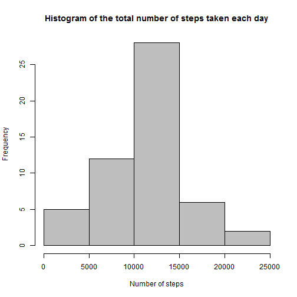
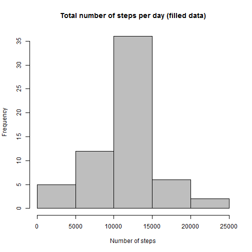
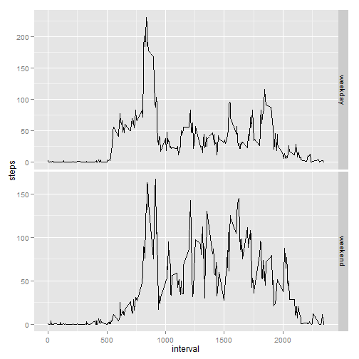

 Reproducable Research
======================

###Peer Assessment 1

####Loading and preprocessing the data


```r
activity<-read.csv("activity.csv", header=T,colClasses=c("numeric","Date","numeric"))
```

####Mean total number of steps taken per day  

Let's compute the total number of steps taken per day:


```r
totalstepsperday<-tapply(activity$steps,activity$date,sum)
```
and make histogram


```r
hist(totalstepsperday,main="Histogram of the total number of steps taken each day",xlab="Number of steps",col="grey")
```

 

Calculate and report the mean and median total number of steps taken
per day 


```r
mean_steps<- mean(totalstepsperday, na.rm=T)
median_steps<-median(totalstepsperday, na.rm=T)
```

Mean steps taken per day is **1.0766189 &times; 10<sup>4</sup>**

Median steps taken per day is **1.0765 &times; 10<sup>4</sup>**


####Average daily activity pattern

Making a time series plot of the average number of steps taken within each 5-minute interval (averaged across all days)


```r
int_average<-tapply(activity$steps,activity$interval,mean,na.rm=T)
plot(names(int_average),int_average,type="l",xlab="Interval",ylab="Average number of steps")
```

 

Let's find 5-minute interval that contains the maximum number of steps on average across all the days.


```r
maxsteps<-max(int_average)
int_max<-names(int_average[int_average==maxsteps])
```

So, this is the interval **835** and maximum number of steps is **206.1698113**

####Imputing missing values

Calculate and report the total number of rows with missing values 


```r
miss_val_rows<-nrow(activity)-sum(complete.cases(activity))
```

Total number of rows with missing values is **2304**  

Filling in all of the missing values in the dataset

The stategy is to substitute missing values using mean of corresponding 5-minute interval

Creating a new dataset (named activity1) with the missing data filled in


```r
#int_average is the vector of means for each interval and was previously calculated
activity1<-activity
missed_names<-as.character(activity1[is.na(activity1[,"steps"]),"interval"])
missed_values<-int_average[missed_names]

activity1[is.na(activity1[,"steps"]),"steps"]<-missed_values
```

Histogram of the total number of steps taken each day with the missing data filled in


```r
totalstepsperday1<-tapply(activity1$steps,activity1$date,sum)
hist(totalstepsperday1,main="Total number of steps per day (filled data)",xlab="Number of steps",col="grey")
```

 


The mean and median total number of steps taken per day.


```r
new_mean<-mean(totalstepsperday1)
new_median<-median(totalstepsperday1)
```

New mean steps taken per day is **1.0766189 &times; 10<sup>4</sup>** (compare to 1.0766189 &times; 10<sup>4</sup>)

New median steps taken per day is **1.0766189 &times; 10<sup>4</sup>** (compare to 1.0765 &times; 10<sup>4</sup>)

####Differences in activity patterns between weekdays and weekends

Create a new factor variable in the dataset with two levels – “weekday”
and “weekend”


```r
activity1$day<-as.factor(weekdays(activity1$date,abbreviate=T))
levels(activity1$day)[!(levels(activity1$day)=="Ñá"|levels(activity1$day)=="Íä")] <- "weekday"   
levels(activity1$day)[(levels(activity1$day)=="Ñá"|levels(activity1$day)=="Íä")] <- "weekend"
```

Make a panel plot containing a time series plot of the
5-minute interval and the average number of steps taken, averaged across all weekday days or weekend days.


```r
library(ggplot2)
qplot(interval,steps, data=activity1,stat="summary", fun.y=mean, geom="line")+facet_grid(day~.,scales = "free_y")
```

 

